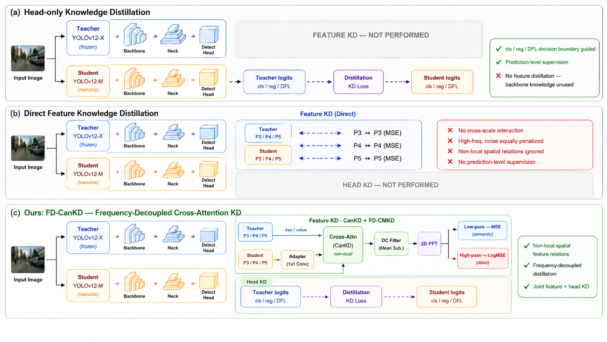

<h2 align="center">YOLOv12-Distillation</h2>

<p align="center">
  <strong>YOLOv12 X to M Knowledge Distillation</strong>
  <br>
  <strong>Plain KD · CanKD · FD-CMKD · Head Output KD</strong>
</p>

<p align="center">
  <a href="https://github.com/YoungJae1559/YOLOv12-Distillation">
    <strong><code>💻 Source Code</code></strong>
  </a>
</p>

<p align="center">
  
</p>

<p align="center">
  <strong>Overview of YOLOv12 X to M distillation strategies.</strong>
</p>

---

## 🔥 News

- This repository provides a YOLOv12-based knowledge distillation framework.
- The default setting is **YOLOv12-X teacher to YOLOv12-M student**.
- Supported distillation modes include **Plain KD**, **CanKD**, **Head-only KD**, and **FD-CMKD**.
- Pretrained weights and experiment outputs are not included in this repository.

---

## Overview

This repository implements knowledge distillation for YOLOv12 object detection.

The goal is to transfer knowledge from a high-capacity teacher model to a compact student model.

```text
Teacher model : YOLOv12-X
Student model : YOLOv12-M
Dataset       : COCO
Input size    : 640
Batch size    : 16
Epochs        : 50
```

The distillation framework supports both feature-level and head-level knowledge transfer.

```text
1. Plain KD
   - Direct feature distillation
   - Head output distillation

2. CanKD
   - Cross-attention non-local feature distillation
   - Teacher-student feature relation transfer

3. Head-only KD
   - Classification logit distillation
   - Box regression and DFL distillation
   - Feature KD disabled

4. FD-CMKD
   - Frequency-decoupled feature distillation
   - Low-frequency feature alignment
   - High-frequency feature regularization
```

---

## Repository Structure

```text
YOLOv12-Distillation/
├── assets/
├── datasets/
├── docker/
├── examples/
├── logs/
├── runs/
├── tests/
├── tools/
├── ultralytics/
├── ultralytics.egg-info/
├── app.py
├── coco.yaml
├── mkdocs.yml
├── pyproject.toml
├── README.md
├── References.txt
├── requirements.txt
└── .gitignore
```

The following files are excluded from Git tracking.

```text
runs/
yolov12m.pt
yolov12n.pt
yolov12s.pt
yolov12x.pt
flash_attn*.whl
```

---

## Installation

```bash
conda create -n yolov12 python=3.11 -y
conda activate yolov12

git clone https://github.com/YoungJae1559/YOLOv12-Distillation.git
cd YOLOv12-Distillation

pip install -r requirements.txt
pip install -e .
```

If FlashAttention is required, install it manually according to the CUDA and PyTorch version.

```bash
pip install flash-attn --no-build-isolation
```

If a local wheel file is used, install it as follows.

```bash
pip install flash_attn-2.7.3+cu11torch2.2cxx11abiFALSE-cp311-cp311-linux_x86_64.whl
```

---

## Checkpoint Preparation

This repository does not include YOLOv12 pretrained weights because large checkpoint files are excluded from Git.

Place the required `.pt` files in the project root directory.

```text
/home/vip/harry/yolov12/
├── yolov12m.pt
├── yolov12n.pt
├── yolov12s.pt
└── yolov12x.pt
```

The default teacher checkpoint is:

```text
/home/vip/harry/yolov12/yolov12x.pt
```

The default baseline student checkpoint is:

```text
/home/vip/harry/yolov12/runs/detect/yolov12m/weights/best.pt
```

---

## Dataset Preparation

The default dataset configuration is `coco.yaml`.

```text
/home/vip/harry/yolov12/coco.yaml
```

Before training, check whether the dataset path inside `coco.yaml` is correctly configured.

```bash
cat /home/vip/harry/yolov12/coco.yaml
```

---

## Baseline YOLOv12-M Training

Before distillation, train the YOLOv12-M student model.

```bash
CUDA_VISIBLE_DEVICES=1 yolo detect train \
  model=/home/vip/harry/yolov12/yolov12m.pt \
  data=/home/vip/harry/yolov12/coco.yaml \
  epochs=50 \
  imgsz=640 \
  batch=16 \
  device=0 \
  amp=True \
  name=yolov12m
```

The trained baseline checkpoint will be saved to:

```text
/home/vip/harry/yolov12/runs/detect/yolov12m/weights/best.pt
```

---

## 1. Plain KD Training

Plain KD uses direct feature distillation and head output distillation.

```bash
CUDA_VISIBLE_DEVICES=1 \
YOLO_TEACHER=/home/vip/harry/yolov12/yolov12x.pt \
YOLO_KD_TYPE=plain_kd \
YOLO_KD_W=0.1 \
YOLO_KD_HEAD_W=0.2 \
YOLO_KD_HEAD_CLS_W=1.0 \
YOLO_KD_HEAD_REG_W=1.0 \
YOLO_KD_HEAD_TAU=2.0 \
YOLO_KD_HEAD_MIN_CONF=0.1 \
YOLO_KD_P3=0.25 \
YOLO_KD_P4=1.0 \
YOLO_KD_P5=1.0 \
YOLO_PLAIN_FEAT_W=1.0 \
yolo detect train \
  model=/home/vip/harry/yolov12/runs/detect/yolov12m/weights/best.pt \
  data=/home/vip/harry/yolov12/coco.yaml \
  epochs=50 \
  imgsz=640 \
  batch=16 \
  device=0 \
  amp=True \
  name=yolov12m_plainkd_x2m
```

---

## 2. CanKD Training

CanKD transfers teacher-student feature relations using cross-attention non-local distillation.

```bash
CUDA_VISIBLE_DEVICES=1 \
YOLO_TEACHER=/home/vip/harry/yolov12/yolov12x.pt \
YOLO_KD_TYPE=cankd \
YOLO_KD_W=0.15 \
YOLO_KD_HEAD_W=0.2 \
YOLO_KD_HEAD_CLS_W=1.0 \
YOLO_KD_HEAD_REG_W=1.0 \
YOLO_KD_HEAD_TAU=2.0 \
YOLO_KD_HEAD_MIN_CONF=0.1 \
YOLO_KD_P3=0.5 \
YOLO_KD_P4=1.0 \
YOLO_KD_P5=1.25 \
yolo detect train \
  model=/home/vip/harry/yolov12/runs/detect/yolov12m/weights/best.pt \
  data=/home/vip/harry/yolov12/coco.yaml \
  epochs=50 \
  imgsz=640 \
  batch=16 \
  device=0 \
  amp=True \
  name=yolov12m_cankd_x2m_main
```

---

## 3. Head-only KD Fine-tuning

This stage disables feature KD and applies only head output distillation.

It is useful for short fine-tuning after CanKD training.

```bash
CUDA_VISIBLE_DEVICES=1 \
YOLO_TEACHER=/home/vip/harry/yolov12/yolov12x.pt \
YOLO_KD_TYPE=cankd \
YOLO_KD_W=0.0 \
YOLO_KD_HEAD_W=0.30 \
YOLO_KD_HEAD_CLS_W=1.0 \
YOLO_KD_HEAD_REG_W=1.0 \
YOLO_KD_HEAD_TAU=2.0 \
YOLO_KD_HEAD_MIN_CONF=0.20 \
YOLO_KD_P3=0.0 \
YOLO_KD_P4=0.0 \
YOLO_KD_P5=0.0 \
YOLO_KD_HEAD_WARMUP_EPOCHS=1 \
YOLO_KD_HEAD_DECAY_START=0.95 \
YOLO_KD_HEAD_DECAY_MIN_RATIO=0.95 \
yolo detect train \
  model=/home/vip/harry/yolov12/runs/detect/yolov12m_cankd_x2m_main/weights/best.pt \
  data=/home/vip/harry/yolov12/coco.yaml \
  epochs=15 \
  imgsz=640 \
  batch=16 \
  device=0 \
  amp=True \
  lr0=0.0008 \
  lrf=0.1 \
  name=yolov12m_cankd_x2m_ft
```

---

## 4. FD-CMKD Training

FD-CMKD performs frequency-decoupled feature distillation.

Low-frequency components are aligned using MSE loss, while high-frequency components are regularized using log-scaled feature loss.

```bash
CUDA_VISIBLE_DEVICES=1 \
YOLO_TEACHER=/home/vip/harry/yolov12/yolov12x.pt \
YOLO_KD_TYPE=fd_cmkd \
YOLO_KD_W=0.1 \
YOLO_KD_HEAD_W=0.2 \
YOLO_KD_HEAD_CLS_W=1.0 \
YOLO_KD_HEAD_REG_W=1.0 \
YOLO_KD_HEAD_TAU=2.0 \
YOLO_KD_HEAD_MIN_CONF=0.1 \
YOLO_KD_P3=0.25 \
YOLO_KD_P4=1.0 \
YOLO_KD_P5=1.0 \
YOLO_FD_LOW_KEEP_RATIO=0.25 \
YOLO_FD_LOW_W=1.0 \
YOLO_FD_HIGH_W=0.5 \
YOLO_FD_LOSS_W=1.0 \
yolo detect train \
  model=/home/vip/harry/yolov12/runs/detect/yolov12m/weights/best.pt \
  data=/home/vip/harry/yolov12/coco.yaml \
  epochs=50 \
  imgsz=640 \
  batch=16 \
  device=0 \
  amp=True \
  name=yolov12m_fdcmkd_x2m
```

---

## Evaluation

Evaluate a trained checkpoint on the validation set.

```bash
yolo detect val \
  model=/home/vip/harry/yolov12/runs/detect/yolov12m_cankd_x2m_main/weights/best.pt \
  data=/home/vip/harry/yolov12/coco.yaml \
  imgsz=640 \
  batch=16 \
  device=0
```

Evaluate the fine-tuned checkpoint.

```bash
yolo detect val \
  model=/home/vip/harry/yolov12/runs/detect/yolov12m_cankd_x2m_ft/weights/best.pt \
  data=/home/vip/harry/yolov12/coco.yaml \
  imgsz=640 \
  batch=16 \
  device=0
```

---

## Inference

Run prediction using a trained distillation checkpoint.

```bash
yolo detect predict \
  model=/home/vip/harry/yolov12/runs/detect/yolov12m_cankd_x2m_main/weights/best.pt \
  source=/path/to/images \
  imgsz=640 \
  device=0 \
  save=True
```

---

## Export

Export the trained model to ONNX.

```bash
yolo export \
  model=/home/vip/harry/yolov12/runs/detect/yolov12m_cankd_x2m_main/weights/best.pt \
  format=onnx \
  imgsz=640
```

Export the trained model to TensorRT engine.

```bash
yolo export \
  model=/home/vip/harry/yolov12/runs/detect/yolov12m_cankd_x2m_main/weights/best.pt \
  format=engine \
  imgsz=640 \
  half=True
```

---

## Distillation Arguments

| Argument | Description |
|---|---|
| `YOLO_TEACHER` | Path to the frozen YOLOv12-X teacher checkpoint |
| `YOLO_KD_TYPE` | Distillation type: `plain_kd`, `cankd`, or `fd_cmkd` |
| `YOLO_KD_W` | Overall feature distillation loss weight |
| `YOLO_KD_HEAD_W` | Head output distillation loss weight |
| `YOLO_KD_HEAD_CLS_W` | Classification logit distillation weight |
| `YOLO_KD_HEAD_REG_W` | Box regression or DFL distillation weight |
| `YOLO_KD_HEAD_TAU` | Temperature value for head output KD |
| `YOLO_KD_HEAD_MIN_CONF` | Minimum teacher confidence threshold |
| `YOLO_KD_P3` | P3 feature distillation weight |
| `YOLO_KD_P4` | P4 feature distillation weight |
| `YOLO_KD_P5` | P5 feature distillation weight |
| `YOLO_PLAIN_FEAT_W` | Plain feature distillation weight |
| `YOLO_FD_LOW_KEEP_RATIO` | Low-frequency keep ratio for FD-CMKD |
| `YOLO_FD_LOW_W` | Low-frequency distillation weight |
| `YOLO_FD_HIGH_W` | High-frequency distillation weight |
| `YOLO_FD_LOSS_W` | Overall FD-CMKD loss weight |

---

## Recommended Training Pipeline

```text
Step 1. Train YOLOv12-M baseline
Step 2. Run Plain KD or CanKD
Step 3. Run Head-only KD fine-tuning if needed
Step 4. Run FD-CMKD for frequency-based distillation comparison
Step 5. Evaluate all checkpoints under the same validation protocol
```

---

## Git Upload Note

Large files and training outputs are excluded from this repository.

```text
runs/
yolov12m.pt
yolov12n.pt
yolov12s.pt
yolov12x.pt
flash_attn*.whl
```

To apply the same `.gitignore` setting:

```bash
printf "%s\n" \
"runs/" \
"yolov12m.pt" \
"yolov12n.pt" \
"yolov12s.pt" \
"yolov12x.pt" \
"flash_attn*.whl" > .gitignore
```

If these files were already tracked by Git, remove them from Git tracking only.

```bash
git rm -r --cached --ignore-unmatch runs
git rm --cached --ignore-unmatch yolov12m.pt
git rm --cached --ignore-unmatch yolov12n.pt
git rm --cached --ignore-unmatch yolov12s.pt
git rm --cached --ignore-unmatch yolov12x.pt
git rm --cached --ignore-unmatch flash_attn*.whl
```

---

## Acknowledgement

This repository is based on YOLOv12 and Ultralytics-style training code.

We thank the original YOLOv12 authors and the Ultralytics open-source community for their excellent work.

---

## Citation

```BibTeX
@article{tian2025yolov12,
  title={YOLOv12: Attention-Centric Real-Time Object Detectors},
  author={Tian, Yunjie and Ye, Qixiang and Doermann, David},
  journal={arXiv preprint arXiv:2502.12524},
  year={2025}
}
```
